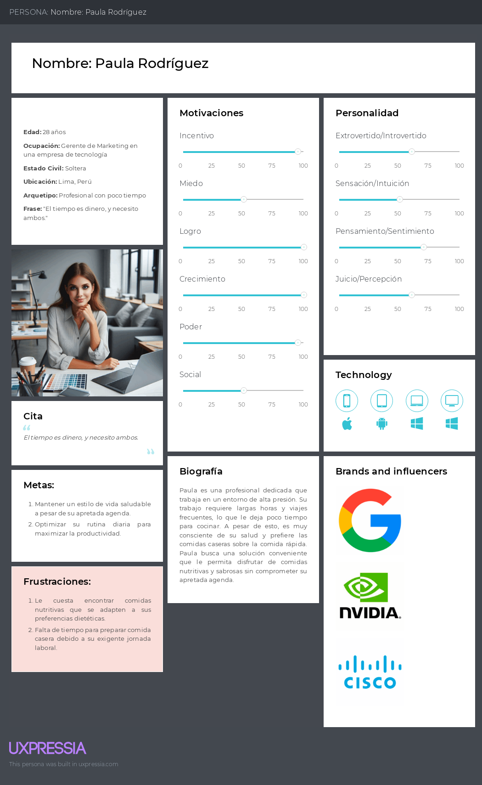
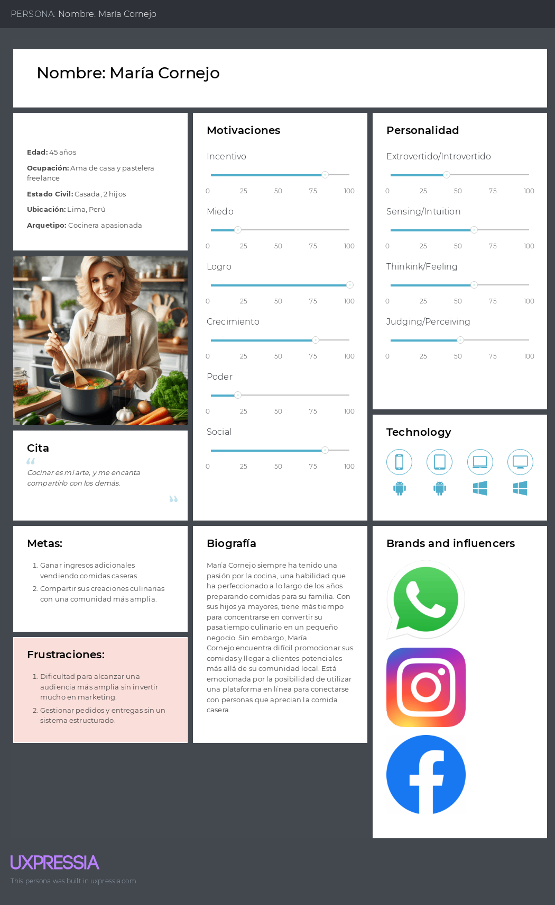
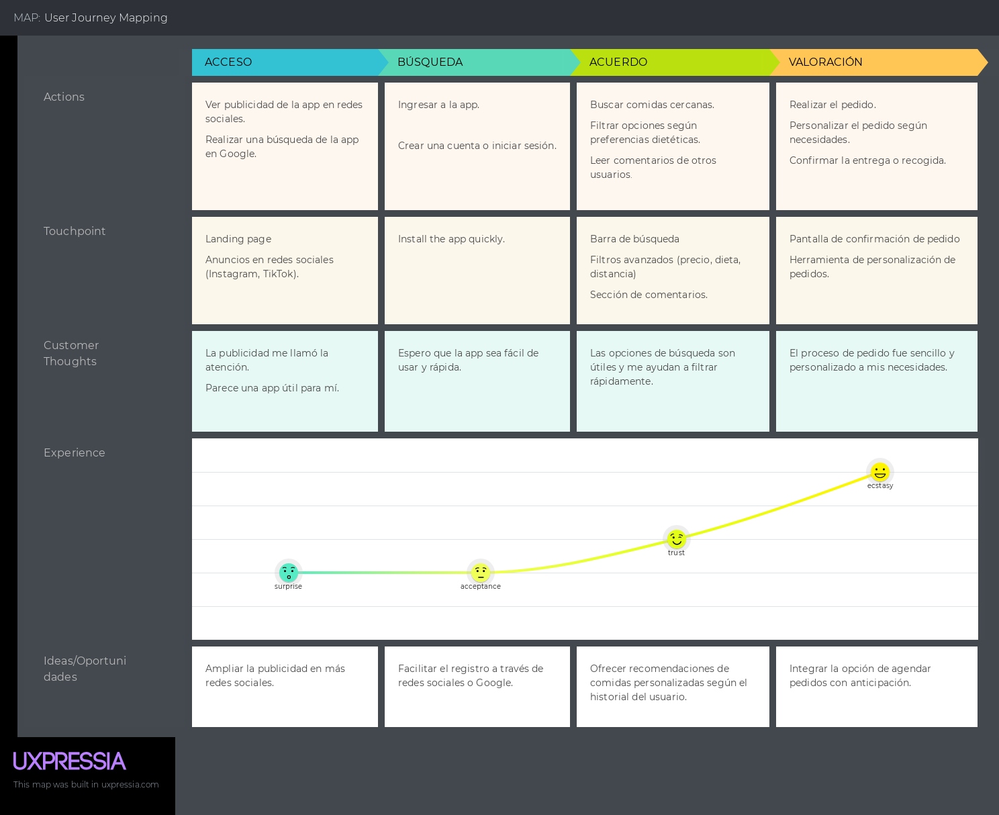
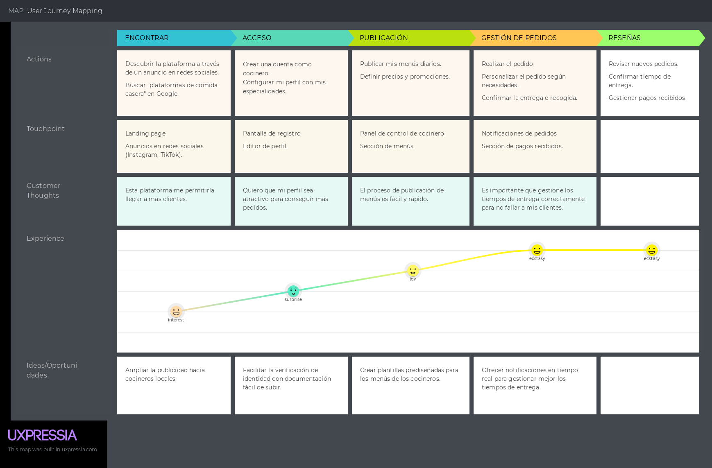

**Universidad Peruana de Ciencias Aplicadas**

**Ingeniería de Software \- Grupo 5 (WX53)**

**Aplicaciones Web** 

# INFORME DEL TRABAJO FINAL

**Profesor:** Alberto Wilmer Sanchez Seña

**Startup:** Cybernetic Coders

**Grupo:** 5

**Producto:** Sabores Cercanos

**Integrantes:**

* **Dalila Victoria Torres Sanchez \- U20221F734**  
* **Rafael Alberto Cuya Villegas \- U201913495**
* **Miguel Angel Gomez Hurtado \- U202220294**  
* **4  \- 4**  
* **5  \- 5**  

## REGISTRO DE VERSIONES DEL INFORME

## PROJECT REPORT COLLABORATION INSIGHTS

#### 1. URL del Repositorio en GitHub

| Repositorio del Informe en GitHub |
|-----------------------------------|
| https://github.com/orgs/upc-pre-si730-WX53-CyberneticCoders/repositories |

#### 2. Actividades de Elaboración del Informe

| Actividad                           | Descripción                                                                                          |
|-------------------------------------|------------------------------------------------------------------------------------------------------|
| Comunicación de avances            | Se realizaron reuniones virtuales donde se comentaban los avances de cada integrante del equipo para garantizar un trabajo sincronizado y tener conocimiento de cada modificación.                                |
| Delegación de responsabilidades    | Se organizaron pequeñas reuniones para la delegación de tareas y se enfatizó la importancia de revisar cuidadosamente el enunciado del proyecto para evitar irregularidades futuras.                              |
| Revisión de ortografía             | Se mantuvo un control exhaustivo de la redacción del informe y se enfatizó la importancia de revisar en todo momento las nomenclaturas utilizadas, respetando las convenciones y el uso de buenas prácticas.                                                        |
| Recopilación de datos              | Se obtuvieron datos mediante entrevistas y referencias bibliográficas, los cuales se utilizaron para sustentar los argumentos expuestos en el informe.                                                          |
| Desarrollo del informe              | Se completaron las diferentes secciones del informe, empleando las herramientas y metodologías apropiadas de acuerdo a las indicaciones del proyecto.                                                         |

#### 3. Capturas de Imagen de los Analíticos de Colaboración y Commits en GitHub

#### 4. Participación de Todos los Miembros del Equipo

# CONTENIDO

## **TABLA DE CONTENIDOS**

**Carátula**

**Registro de Versiones del Informe**

**Project Report Collaboration Insights**

**Contenido**

**Tabla de contenidos**

**Student Outcome**

**Capítulo I: Introducción**

**1.1. Startup Profile**

**1.1.1. Descripción de la Startup**

**1.1.2. Perfiles de integrantes del equipo**

**1.2. Solution Profile**

**1.2.1 Antecedentes y problemática**

**1.2.2 Lean UX Process.**

**1.2.2.1. Lean UX Problem Statements.**

**1.2.2.2. Lean UX Assumptions.**

**1.2.2.3. Lean UX Hypothesis Statements.**

**1.2.2.4. Lean UX Canvas.**

**1.3. Segmentos objetivo.**

**Capítulo II: Requirements Elicitation & Analysis**

**2.1. Competidores.**

**2.1.1. Análisis competitivo.**

**2.1.2. Estrategias y tácticas frente a competidores.**

**2.2. Entrevistas.**

**2.2.1. Diseño de entrevistas.**

**2.2.2. Registro de entrevistas.**

**2.2.3. Análisis de entrevistas.**

**2.3. Needfinding.**

**2.3.1. User Personas.**

**2.3.2. User Task Matrix.**

**2.3.3. User Journey Mapping.**

**2.3.4. Empathy Mapping.**

**2.3.5. As-is Scenario Mapping.**

**2.4. Ubiquitous Language.**

**Capítulo III: Requirements Specification**

**3.1. To-Be Scenario Mapping.**

**3.2. User Stories.**

**3.3. Impact Mapping.**

**3.4. Product Backlog.**

**Capítulo IV: Product Design**

**4.1. Style Guidelines.**

**4.1.1. General Style Guidelines.**

**4.1.2. Web Style Guidelines.**

**4.2. Information Architecture.**

**4.2.1. Organization Systems.**

**4.2.2. Labeling Systems.**

**4.2.3. SEO Tags and Meta Tags**

**4.2.4. Searching Systems.**

**4.2.5. Navigation Systems.**

**4.3. Landing Page UI Design.**

**4.3.1. Landing Page Wireframe.**

**4.3.2. Landing Page Mock-up.**

**4.4. Web Applications UX/UI Design.**

**4.4.1. Web Applications Wireframes.**

**4.4.2. Web Applications Wireflow Diagrams.**

**4.4.2. Web Applications Mock-ups.**

**4.4.3. Web Applications User Flow Diagrams.**

**4.5. Web Applications Prototyping.**

**4.6. Domain-Driven Software Architecture.**

**4.6.1. Software Architecture Context Diagram.**

**4.6.2. Software Architecture Container Diagrams.**

**4.6.3. Software Architecture Components Diagrams.**

**4.7. Software Object-Oriented Design.**

**4.7.1. Class Diagrams.**

**4.7.2. Class Dictionary.**

**4.8. Database Design.**

**4.8.1. Database Diagram.**

**Capítulo V: Product Implementation, Validation & Deployment**

**5.1. Software Configuration Management.**

**5.1.1. Software Development Environment Configuration.**

**5.1.2. Source Code Management.**

**5.1.3. Source Code Style Guide & Conventions.**

**5.1.4. Software Deployment Configuration.**

**5.2. Landing Page, Services & Applications Implementation.**

**5.2.1. Sprint 1**

**5.2.1.1. Sprint Planning 1.**

**5.2.1.2. Sprint Backlog 1.**

**5.2.1.3. Development Evidence for Sprint Review.**

**5.2.1.4. Testing Suite Evidence for Sprint Review.**

**5.2.1.5. Execution Evidence for Sprint Review.**

**5.2.1.6. Services Documentation Evidence for Sprint Review.**

**5.2.1.7. Software Deployment Evidence for Sprint Review.**

**5.2.1.8. Team Collaboration Insights during Sprint.**

**5.3. Validation Interviews.**

**5.3.1. Diseño de Entrevistas.**

**5.3.2. Registro de Entrevistas.**

**5.3.3. Evaluaciones según heurísticas.**

**5.4. Video About-the-Product.**

**Conclusiones**

- **Conclusiones y recomendaciones.**  
- **Video About-the-Team.**

**Bibliografía**  
**Anexos**

# STUDENT OUTCOME

# Capítulo 1: Introducción

## **1.1. Startup Profile**

El término Startup se utiliza para describir pequeñas y medianas empresas que ingresan al mercado con ideas vinculadas al mundo tecnológico, con notables perspectivas de desarrollo. Una Startup se distingue por ser un negocio escalable, con gran potencial de crecimiento y con una veloz y efectiva expansión. Por otro lado, las Startups surgen con la finalidad de resolver con claridad un problema social de gran relevancia, de una forma simple e innovadora.

### **1.1.1. Descripción de la Startup**

#### **Descripción de la empresa:**

"Sabores Cercanos" es una plataforma web diseñada para conectar a cocineros caseros con universitarios y profesionales que carecen de tiempo para cocinar. La plataforma permite a los cocineros ofrecer sus servicios de comida, incluyendo menús personalizados, precios, ubicaciones, y ofertas especiales. Los consumidores pueden buscar, seleccionar y pedir comida casera de cocineros locales, basándose en sus preferencias alimenticias y restricciones dietéticas. Además, "Sabores Cercanos" promueve una comunidad culinaria activa donde se pueden compartir y descubrir recetas, fomentando la interacción entre cocineros y consumidores.

La propuesta de valor de "Sabores Cercanos" se centra en proporcionar comida casera de calidad, personalizada y a precios asequibles, mientras que ofrece a los cocineros una vía para generar ingresos adicionales de forma flexible. A través de una interfaz intuitiva y procesos eficientes, "Sabores Cercanos" crea un ecosistema donde la pasión por la cocina y la necesidad de comidas prácticas y saludables se encuentran.

##### **Misión:**

La misión de "Sabores Cercanos" es transformar la forma en que las personas acceden a la comida casera, conectando a cocineros apasionados con consumidores que buscan opciones de alimentación saludable y conveniente. Aspiramos a empoderar a los cocineros caseros, brindándoles la oportunidad de monetizar sus habilidades culinarias, mientras mejoramos la calidad de vida de nuestros consumidores a través de alimentos nutritivos y sabrosos. Fomentamos una comunidad en la que compartir la pasión por la cocina se convierte en una experiencia enriquecedora para todos.

##### **Visión:**

Nuestra visión es ser la plataforma líder en conectar cocineros caseros y consumidores en América Latina, reconocida por ofrecer calidad, confianza y una experiencia gastronómica única. Queremos crear un movimiento que celebre la comida casera y las tradiciones culinarias locales, mientras promovemos estilos de vida saludables y sostenibles. Buscamos establecer un estándar en la economía colaborativa del sector alimentario, donde la comida casera se convierta en una opción accesible y preferida para todos, y donde cada cocinero tenga la oportunidad de compartir su talento y mejorar su vida.

### 1.1.2. Perfiles De Integrantes Del Equipo

#### Nombre: Gomez Hurtado, Miguel Angel | U202220294

> Descripción, carrera, habilidades técnicas, habilidades blandas.
>
> [Imagen]

---
####  | 

> Descripción, carrera, habilidades técnicas, habilidades blandas.
>
> [Imagen]

---
#### Nombre:  | 
> Descripción, carrera, habilidades técnicas, habilidades blandas.
>
> [Imagen]

---
#### Nombre:  | 
> Descripción, carrera, habilidades técnicas, habilidades blandas.
>
> [Imagen]

---
#### Nombre:  | 

> Descripción, carrera, habilidades técnicas, habilidades blandas.
>
> [Imagen]

---

## **1.2. Solution Profile**

### **1.2.1 Antecedentes y problemática**

En el siguiente apartado, nos encargamos de investigar en detalle el problema en sí mismo. El objetivo es determinar las causas del problema que se deben abordar.

**What?**

* ¿Qué problema hay?  
  Muchas personas, especialmente universitarios y profesionales, no tienen tiempo para cocinar debido a sus horarios ocupados. Esto los lleva a depender de comida rápida o de baja calidad, afectando su salud y bienestar. Por otro lado, hay muchas personas que disfrutan cocinar y buscan una manera de generar ingresos adicionales desde casa, monetizando su habilidad culinaria sin tener que invertir en un restaurante completo o un negocio de catering.

**When?**

* ¿Cuándo sucede el problema?  
  El problema es continuo. Ocurre diariamente cuando los consumidores enfrentan la necesidad de comer mientras equilibran otras responsabilidades, como el trabajo o los estudios. El problema se intensifica durante las horas pico de almuerzo y cena, cuando el tiempo es limitado.  
* ¿Cuándo el cliente necesita el programa?  
  Los consumidores necesitan la plataforma durante sus horarios de comida, especialmente durante el almuerzo y la cena. Los cocineros necesitan la plataforma para poder planificar y gestionar sus servicios de manera eficiente, incluyendo la publicación de menús y la preparación de pedidos.

**Where?**

* ¿Dónde el cliente usara el producto?  
  La aplicación se usará principalmente en entornos urbanos, donde hay una alta concentración de profesionales y estudiantes. Los consumidores usarán la aplicación desde sus teléfonos móviles o computadoras para hacer pedidos mientras están en casa, en la oficina o en el campus.

**Why?**

* Debido a la necesidad de ofrecer una solución que conecte a personas que valoran la comida casera con cocineros que desean generar ingresos adicionales. Los consumidores buscan opciones de comida que se adapten a sus preferencias y restricciones alimenticias, mientras que los cocineros buscan una plataforma que les permita monetizar su pasión de manera flexible y accesible. Este problema afecta tanto a la salud de los consumidores como a la economía de los cocineros caseros, quienes podrían beneficiarse de una fuente adicional de ingresos.

**Who?**

* *Consumidores:* Universitarios y profesionales que no tienen tiempo para cocinar pero desean opciones saludables y personalizadas.  
* *Proveedores:* Cocineros caseros que buscan una manera de monetizar su habilidad culinaria y generar ingresos adicionales desde sus hogares.

**How?**

* "Sabores Cercanos" propone una plataforma web que conecta a cocineros caseros con consumidores que buscan opciones de comida casera y personalizada. Esto permite a los cocineros caseros ofrecer sus servicios de comida directamente a los consumidores, quienes pueden buscar, seleccionar y personalizar sus pedidos de manera fácil y eficiente. La plataforma también fomenta una comunidad activa donde se comparten recetas y se promueve la interacción culinaria.

Los principales puntos del funcionamiento son:

* Registro y Perfil del Usuario: Cocineros y consumidores se registran y crean perfiles detallados que facilitan la oferta y búsqueda de servicios.  
* Publicación y Gestión de Servicios de Comida: Los cocineros publican menús, precios y promociones, con opciones para personalizar según las necesidades dietéticas de los usuarios.  
* Búsqueda y Selección de Servicios: Los consumidores utilizan filtros avanzados para encontrar opciones que se ajusten a sus preferencias y ubicación.  
* Pedidos y Personalización: Los consumidores realizan pedidos personalizados con especificación de fecha y hora de entrega o recogida.  
* Pagos y Gestión de Pedidos: La plataforma procesa pagos y gestiona el estado de los pedidos, asegurando un servicio eficiente.  
* Entrega o Recogida: Dependiendo del acuerdo, los cocineros entregan la comida o los consumidores la recogen, con opciones de rastreo en tiempo real.  
* Sistema de Revisión y Feedback: Consumidores y cocineros pueden dejar reseñas y calificaciones para mejorar la calidad del servicio.  
* Recetas de Cocina y Comunidad: Los cocineros pueden compartir recetas, creando una comunidad culinaria activa que enriquece la experiencia del usuario.

**How much?**

* Los costos para los cocineros caseros incluyen los insumos para preparar las comidas y una comisión por transacción que cobra la plataforma. Para los consumidores, los costos están relacionados con el precio de los menús seleccionados, que se establecen de manera competitiva para asegurar que sean accesibles en comparación con otras opciones de comida rápida o a domicilio.

### **1.2.2 Lean UX Process.**  
	  
#### **1.2.2.1. Lean UX Problem Statements.**  
	  
Sabores Cercanos es una plataforma web diseñada para conectar a cocineros caseros con universitarios y profesionales que carecen de tiempo para cocinar. La propuesta de valor se centra en proporcionar comida casera de calidad, personalizada y a precios accesibles, al mismo tiempo que ofrece a los cocineros una oportunidad de generar ingresos adicionales de forma flexible.

Hemos observado un factor crítico que afecta a los universitarios y profesionales ocupados y cocineros caseros.

**Problema:**  
La falta de acceso a opciones de comida casera y saludable afecta la calidad de vida de universitarios y profesionales ocupados, quienes a menudo dependen de opciones rápidas y menos nutritivas debido a sus limitados horarios. Al mismo tiempo, muchos cocineros caseros no tienen una manera efectiva de monetizar sus habilidades culinarias sin tener que invertir en un restaurante o negocio de catering.

**Pregunta central:**  
¿Cómo podemos mejorar la accesibilidad a comida casera y personalizada para los consumidores, al mismo tiempo que facilitamos a los cocineros caseros la monetización de sus habilidades culinarias de manera eficiente y flexible?

#### **1.2.2.2. Lean UX Assumptions.**

**Business Outcomes**

* Incremento en la cantidad de cocineros caseros registrados en la plataforma.  
* Aumento en el número de pedidos diarios realizados a través de la plataforma.  
* Mejora en la retención y satisfacción tanto de cocineros como de consumidores, reflejada en altas calificaciones y feedback positivo.  
* Generación de ingresos estables a través de comisiones por transacción y el establecimiento de suscripciones premium.

**User Benefits**

* Para los consumidores: Acceso a comida casera de calidad, adaptada a sus preferencias dietéticas, y la conveniencia de recibirla en su hogar o recogerla.  
* Para los cocineros: Una manera accesible y flexible de monetizar sus habilidades culinarias sin necesidad de grandes inversiones.  
* Creación de una comunidad culinaria donde se comparten y descubren recetas, enriqueciendo la experiencia de los usuarios.

**User & Customers**

1. *¿Quién(es) es el usuario?*  
* Cocineros caseros (amateur) que desean generar ingresos adicionales ofreciendo sus servicios de comida.  
* Universitarios y profesionales ocupados que buscan opciones de comida casera y saludable.  
2. *¿Dónde encaja nuestro producto en su trabajo o vida?*  
* Para los consumidores, encaja en sus rutinas diarias, especialmente durante horarios de comida como almuerzos y cenas, cuando necesitan opciones rápidas, saludables y convenientes.  
* Para los cocineros, encaja como una oportunidad para generar ingresos desde casa en horarios flexibles, permitiéndoles seguir su pasión por la cocina.  
3. *¿Qué problemas tiene nuestro producto que resolver?*  
* La falta de tiempo y acceso a comida saludable para consumidores ocupados.  
* La falta de oportunidades accesibles para que los cocineros caseros moneticen sus habilidades sin grandes inversiones.  
4. *¿Cuándo y cómo es nuestro producto usado?*  
* El producto es usado diariamente por los consumidores para pedir comida, especialmente durante horas de almuerzo y cena.  
* Los cocineros usan la plataforma para gestionar sus menús, pedidos y entregas en cualquier momento del día, según su disponibilidad.  
5. *¿Qué características son importantes?*  
* Registro y creación de perfiles detallados para cocineros y consumidores.  
* Publicación y gestión de menús, incluyendo personalización según necesidades dietéticas.  
* Búsqueda avanzada y filtros para los consumidores.  
* Sistema de pagos seguro y eficiente.  
* Sistema de calificaciones y feedback para mejorar la experiencia de usuario.  
6. *¿Cómo debe verse nuestro producto y cómo debe comportarse?*  
* El producto debe tener una interfaz intuitiva y atractiva, fácil de navegar tanto para cocineros como para consumidores.  
* Debe comportarse de manera rápida y responsiva, permitiendo a los usuarios completar sus tareas sin fricciones.  
* Debe ser confiable y seguro, especialmente en el manejo de pagos y datos personales.

**¿Qué es lo que brinda mi producto?**  
1.	Creemos que nuestros clientes necesitan:

* Los consumidores necesitan acceso a opciones de comida saludable y personalizada de manera conveniente.  
* Los cocineros necesitan una plataforma que les permita monetizar su pasión por la cocina de forma accesible y flexible.

2.	Estas necesidades se pueden resolver con:

* Una plataforma web que conecte a cocineros caseros con los consumidores, facilitando la búsqueda, pedido y entrega de comida casera.

3.	Nuestros clientes son o serán:

* Universitarios y profesionales ocupados que valoran la comida saludable pero no tienen tiempo para cocinar.  
* Cocineros caseros que desean generar ingresos adicionales ofreciendo sus servicios de comida.

4.	El valor \#1 que un cliente quiere de nuestro servicio es:

* Para los consumidores: Comida casera de calidad y personalizada, disponible de manera rápida y conveniente.  
* Para los cocineros: Una oportunidad para monetizar sus habilidades culinarias sin complicaciones.

5.	El cliente también puede obtener estos beneficios adicionales:

* Participación en una comunidad culinaria activa donde pueden descubrir y compartir recetas.  
* Para los cocineros, la posibilidad de construir una reputación y expandir su base de clientes a través de buenas calificaciones y feedback.

6.	Vamos a adquirir la mayoría de mis clientes a través de:

* Marketing digital dirigido a universitarios y profesionales, utilizando redes sociales, anuncios en línea y colaboraciones con influencers culinarios.  
* Para los cocineros, mediante campañas que resalten la oportunidad de generar ingresos adicionales desde casa.

7.	Haremos dinero a través de:

* Comisiones por transacción en cada pedido realizado a través de la plataforma.  
* Posibles suscripciones premium para acceso a características avanzadas o exclusivas.  
* Posibilidad de mostrar publicidad relacionada con el giro comercial de negocio

8.	Nuestra competencia principal en el mercado será:

* Servicios de entrega de comida como UberEats o Rappi, que ofrecen opciones rápidas aunque menos personalizadas y caseras.  
* Empresas de comida como Manzana Verde o LifeCafé.  
* Otros marketplaces de comida casera que puedan surgir.

9.	Los venceremos debido a:

* Un enfoque en comida casera de alta calidad y personalizada, además de una fuerte comunidad culinaria que fomente la interacción y el intercambio de recetas.

10.	Nuestro mayor riesgo de producto es...

* La falta de adopción de la plataforma por parte de cocineros caseros debido a posibles barreras tecnológicas o falta de confianza en la monetización.

11.	Resolveremos esto a través de:

* Proporcionando tutoriales y soporte técnico fácil de entender para cocineros.  
* Ofreciendo incentivos y testimonios de éxito que demuestren la viabilidad de generar ingresos a través de la plataforma.

12.	¿Qué otras suposiciones tenemos? Eso, si se prueba que es falso, causará que nuestro negocio/proyecto no funcione?

* Suponemos que hay una demanda significativa de comida casera personalizada entre universitarios y profesionales ocupados. Si esta demanda es menor de lo esperado, el modelo de negocio podría no ser viable.  
* Suponemos que los cocineros caseros estarán dispuestos a adoptar la tecnología necesaria para operar en la plataforma. Si esto no es cierto, la oferta de servicios podría ser insuficiente para atraer a los consumidores.

#### **1.2.2.3. Lean UX Hypothesis Statements.**

**Hypothesis 1:**

Creemos que mejorar la visibilidad de las promociones especiales dentro de la plataforma atraerá a más usuarios a realizar pedidos con mayor frecuencia.  
Sabremos que estamos bien cuando veamos un aumento del 15% en la cantidad de pedidos realizados durante las 4 primeras semanas en las que se publican promociones especiales.

**Hypothesis 2:**

Creemos que agregar un sistema de reseñas y calificaciones mejorará la confianza de los consumidores en la calidad de la comida y aumentará la tasa de retención de usuarios.  
Sabremos que estamos bien cuando veamos los siguientes comentarios del mercado: Feedback positivo sobre la utilidad de las reseñas y un aumento en la tasa de retención de usuarios del 20%.

**Hypothesis 3:**

Creemos que ofrecer recetas exclusivas y contenido premium para suscriptores motivará a los cocineros y usuarios a suscribirse al servicio premium.  
Sabremos que estamos bien cuando veamos un incremento del 10% en las suscripciones al contenido premium durante el primer mes de lanzamiento.

**Hypothesis 4:**

Creemos que simplificar el proceso de registro y publicación de menús para los cocineros caseros aumentará la cantidad de cocineros activos en la plataforma.  
Sabremos que estamos bien cuando veamos un incremento del 25% en el número de cocineros que publican sus menús dentro del primer mes después de la implementación de estas mejoras.

**Hypothesis 5:**

Creemos que implementar un sistema de notificaciones personalizadas que informe a los usuarios sobre nuevas ofertas o menús cercanos aumentará la frecuencia de uso de la plataforma.  
Sabremos que estamos bien cuando veamos un aumento del 20% en la cantidad de usuarios activos diarios en la plataforma después de la implementación del sistema de notificaciones.

#### **1.2.2.4. Lean UX Canvas.**

| LEAN UX CANVAS |  |  |
| :---- | :---- | :---- |
| **Business problem** | **Solution Ideas** | **Business Outcomes** |
| Universitarios y profesionales ocupados no tienen tiempo para cocinar, lo que los lleva a depender de comida rápida o de baja calidad, afectando su salud. Por otro lado, cocineros caseros buscan monetizar sus habilidades culinarias sin necesidad de grandes inversiones. ¿Cómo podemos mejorar la accesibilidad a comida casera y personalizada para los consumidores, al mismo tiempo que facilitamos a los cocineros caseros la monetización de sus habilidades culinarias de manera eficiente y flexible? | - Desarrollo de una plataforma web que conecte cocineros caseros con consumidores que buscan comida casera.   - Funcionalidades como registro y perfil de usuarios, publicación de menús, búsqueda avanzada, personalización de pedidos, sistema de pagos seguro, y sistema de calificaciones y reseñas.   - Implementación de una sección para compartir y descubrir recetas de cocina dentro de la plataforma. Los cocineros pueden publicar sus recetas favoritas, permitiendo a los usuarios replicarlas en casa. Los usuarios pueden guardar sus recetas preferidas, recibir notificaciones de nuevas publicaciones, y participar en una comunidad culinaria activa |   - Incremento en la cantidad de cocineros caseros registrados en la plataforma.   - Aumento en el número de pedidos diarios realizados a través de la plataforma.   - Mejora en la retención y satisfacción tanto de cocineros como de consumidores, reflejada en altas calificaciones y feedback positivo.   - Generación de ingresos estables a través de comisiones por transacción y posibles suscripciones premium. |
| **Users & Customers** |  | **User Benefits** |
| **- Cocineros Caseros:** Personas que desean generar ingresos adicionales ofreciendo sus servicios de comida casera desde sus hogares.   **- Universitarios y Profesionales Ocupados:** Personas que buscan opciones de comida casera y saludable debido a su falta de tiempo para cocinar. |  | **- Para los Consumidores:** Acceso a comida casera de calidad, personalizada según sus preferencias dietéticas, y la conveniencia de recibirla en su hogar o recogerla.   **- Para los Cocineros:** Una manera accesible y flexible de monetizar sus habilidades culinarias sin necesidad de grandes inversiones.   - Creación de una comunidad culinaria donde se comparten y descubren recetas, enriqueciendo la experiencia de los usuarios. |
| **Hypothesis** | **What’s the most important thing we need to learn first** | **What’s the least amount of work we need to do learn the next most important thing** |
| **Hypothesis 1:**  Creemos que mejorar la visibilidad de las promociones especiales dentro de la plataforma atraerá a más usuarios a realizar pedidos con mayor frecuencia. Un aumento del 15% en la cantidad de pedidos realizados durante las primeras 4 semanas en las que se publican promociones especiales.   **Hypothesis 2:**  Creemos que agregar un sistema de reseñas y calificaciones mejorará la confianza de los consumidores en la calidad de la comida y aumentará la tasa de retención de usuarios. Un aumento en la tasa de retención de usuarios del 20% y feedback positivo sobre la utilidad de las reseñas.   **Hypothesis 3:**  Creemos que simplificar el proceso de registro y publicación de menús para los cocineros caseros aumentará la cantidad de cocineros activos en la plataforma. Un incremento del 25% en el número de cocineros que publican sus menús dentro del primer mes. | Conocer los patrones de comportamiento de los consumidores en relación a la demanda de comida casera. Identificar barreras potenciales que impidan que los cocineros caseros adopten la tecnología de la plataforma. | Realizar entrevistas con cocineros caseros y consumidores potenciales. Crear y probar prototipos de la plataforma con usuarios reales para validar hipótesis clave. |

## **1.3. Segmentos objetivo.**

### **Segmento Objetivo \#1: Universitarios y Profesionales Ocupados** 

Este segmento está compuesto por jóvenes de entre 20 y 40 años que residen en grandes ciudades y centros universitarios de América Latina. Representan alrededor del 60% de los usuarios de la plataforma. Son estudiantes universitarios o profesionales que, debido a sus ocupadas agendas, tienen poco tiempo para cocinar, lo que los lleva a buscar opciones de comida saludable y casera. Valoran la conveniencia y la posibilidad de personalizar sus pedidos según sus preferencias dietéticas. Este grupo prefiere opciones rápidas y asequibles, utilizando la plataforma para recibir comida en sus hogares o lugares de trabajo.

### **Segmento Objetivo \#2: Cocineros Caseros**

Este segmento incluye personas, generalmente entre 30 y 50 años, que viven en áreas urbanas y suburbanas de América Latina. Son apasionados de la cocina y buscan monetizar sus habilidades culinarias sin las complejidades de un restaurante formal. Representan aproximadamente el 40% de los usuarios de la plataforma "Sabores Cercanos". Estos cocineros, que en su mayoría son mujeres, están interesados en ofrecer comida casera de calidad y disfrutan compartiendo sus recetas con una comunidad más amplia. Buscan una fuente de ingresos adicional y flexible, que les permita trabajar desde casa y administrar su propio tiempo.

# Capítulo II: Requirements Elicitation & Analysis

## 2.1. Competidores

Nuestros competidores incluyen a una amplia gama de empresas dentro del sector gastronómico, con un enfoque en aquellas que han desarrollado su presencia en plataformas digitales. Esto abarca tanto a grandes corporaciones de entrega de comida, como a negocios locales que utilizan aplicaciones móviles o sitios web para llegar a sus clientes.

A continuación, mencionaremos algunos de los competidores de nuestro rubro:

### Manzana Verde
[Manzana Verde](https://www.manzanaverde.la/peru/?utm_content=undefined/&utm_source=paid&utm_medium=google&utm_campaign=ao/) es una aplicación disponible para iOS y Android que ofrece una amplia variedad de opciones de comida saludable. Fundada por dos jóvenes emprendedores piuranos, Larissa y Carlos, quienes transformaron su experiencia personal con el sobrepeso en una exitosa startup. La plataforma permite a los usuarios acceder a comidas nutritivas y balanceadas, y gracias a su gran aceptación, actualmente está presente en varios países de Latinoamérica, incluyendo México y Colombia.

### Lifecafe
[Lifecafe](https://www.manzanaverde.la/peru/?utm_content=undefined/&utm_source=paid&utm_medium=google&utm_campaign=ao/) es una empresa especializada en la creación de planes de alimentación saludable, ofreciendo cuatro opciones distintas según tus objetivos. Además, brinda una amplia variedad de alimentos alineados con el plan que elijas, junto con atención personalizada. Con 8 años de liderazgo en su sector, Lifecafe se ha consolidado como una de las mejores alternativas en comida saludable. Su plataforma permite suscribirte a un plan y, en función de este, te ofrece opciones de comida adaptadas a tus metas.

### CookUnity
[CookUnity](https://www.cookunity.com/) es una plataforma que conecta a chefs independientes con clientes, ofreciendo una amplia variedad de platillos para disfrutar en la comodidad del hogar. Con una diversa selección de opciones, CookUnity se ha posicionado como una de las aplicaciones líderes en su sector.

## 2.1.1. Análisis competitivo

### Competitive Analysis Landscape

#### ¿Por qué llevar a cabo este análisis?

Realizaremos un análisis competitivo porque es muy importante identificar oportunidades de diferenciación, entender las fortalezas y debilidades de los competidores, y adaptar la estrategia para posicionar mejor la plataforma en el mercado.

|                        | Sabores Cercanos               | Manzana Verde                  | Lifecafe                        | CookUnity                       |
|------------------------|--------------------------------|--------------------------------|---------------------------------|---------------------------------|
| **Perfil**             | Plataforma que conecta cocineros caseros con consumidores que buscan comida saludable y casera, ofreciendo también una comunidad para compartir recetas. | Plataforma de venta de comida saludable. | Plataforma de venta de comida saludable, basada en el plan de alimentación personalizado mensual, elegido por el usuario. | Plataforma que conecta chefs independientes con consumidores para ofrecer comidas caseras personalizadas y de alta calidad. |
| **Ventaja competitiva** | Enfoque en comida casera auténtica y personalizada, con un fuerte componente comunitario para el intercambio de recetas. | Gran variedad de comidas saludables. | Brinda diversas opciones de planes alimenticios, según los objetivos de cada usuario. | Comidas preparadas por chefs profesionales, destacándose por la personalización y calidad. |
| **Mercado objetivo**    | Universitarios, profesionales ocupados | Adultos y jóvenes que buscan opciones de comida saludable o que desean mejorar su estado físico. | Jóvenes adultos y profesionales que desean transformar su alimentación y mejorar su calidad de vida. | Consumidores de alto poder adquisitivo interesados en comidas personalizadas y de alta calidad. |
| **Estrategias de marketing** | Enfoque en marketing digital dirigido a comunidades locales, campañas que resaltan la autenticidad de la comida casera y la facilidad de uso de la plataforma. | Publicidad masiva a través de redes sociales, promociones agresivas y descuentos para nuevos usuarios. | Marketing mediante redes sociales, promociones cruzadas y programas de lealtad. | Enfoque en la calidad del producto, con campañas dirigidas a nichos específicos interesados en alimentación saludable y gourmet. |
| **Productos & Servicios** | Comida casera preparada por cocineros locales, personalización de pedidos, comunidad de recetas. | Entrega de comida elaborada por ellos mismos. | Entrega de comida basada en el plan alimenticio elegido. | Comidas caseras preparadas por chefs, opciones de suscripción para planes de comida. |
| **Precios & Costos**    | Precios accesibles, comisiones moderadas por transacción. | Precios varían según los ingredientes del plato, cargos adicionales por entrega y servicio. | Costos variados según el plan elegido. | Precios más altos, enfocados en la calidad y personalización, opciones de suscripción. |
| **Canales de distribución** | Aplicación web y móvil con interfaz intuitiva, optimizada para el usuario promedio. | Aplicación móvil y web, con alto nivel de disponibilidad. | Aplicación web y móvil completa con diversas informaciones de sus planes y sus comidas. | Principalmente a través de la aplicación móvil, con un enfoque en la experiencia del usuario y opciones de personalización. |
| **Análisis SWOT**       | **Fortalezas:** Se enfoca solamente en comida casera y personalizada, fuerte componente comunitario, precios accesibles. | **Fortalezas:** Variedad de platos y datos nutricionales, entrega gratuita. | **Fortalezas:** Planes enfocados al objetivo de cada cliente. | **Fortalezas:** Alta calidad y personalización de comidas, chefs independientes. |
| **Debilidades:**        | Red limitada de cocineros en comparación con la red de restaurantes de competidores como UberEats y Rappi. | Disponibilidad de 1 o 2 platos por sección en un mismo día. | Enfocado en conveniencia más que en calidad de alimentos, lo que puede afectar la percepción del servicio de comidas. | Precios elevados, limitado a nichos específicos. |
| **Oportunidades:**      | Crecimiento en mercados locales que valoran la autenticidad y la calidad de la comida casera, expansión a nuevas ciudades y regiones. | Expansión de cantidad de opciones de platos por día. | Expansión de su base de usuarios a través de la diversificación de servicios. | Crecimiento en el mercado de consumidores interesados en salud y gastronomía de alta calidad. |
| **Amenazas:**           | Competencia de grandes plataformas como UberEats y Rappi, que tienen mayores recursos para publicidad y desarrollo de infraestructura. | Nuevas plataformas que ofrecen comida casera de calidad. | Competencia de plataformas más especializadas en comida casera y saludable. | Competencia de plataformas que ofrecen calidad similar a precios más accesibles. |

### 2.1.2. Estrategias y tácticas frente a competidores.

## Entrevistas

### 2.2.1. Diseño de entrevistas

### 2.2.2. Registro de entrevistas

### 2.2.3. Análisis de entrevistas.

## 2.3. Needfinding
### 2.3.1. User Personas
#### Universitarios y Profesionales Ocupados

#### Cocineros Caseros

### 2.3.2. User Task Matrix
#### Universitarios y Profesionales Ocupados

| Task/Historia de Usuario                     | Pia Barandiarán (Frecuencia/Importancia) | Anapaula Díaz (Frecuencia/Importancia) | Piero Gamio (Frecuencia/Importancia) |
|----------------------------------------------|------------------------------------------|----------------------------------------|-------------------------------------|
| **US001 - Registro de consumidor**           | Media / Alta                             | Media / Alta                           | Alta / Alta                         |
| **US002 - Búsqueda de comidas**              | Alta / Alta                              | Alta / Alta                            | Alta / Alta                         |
| **US003 - Filtros avanzados de búsqueda**    | Media / Media                            | Alta / Alta                            | Alta / Alta                         |
| **US004 - Selección de menú personalizado**  | Media / Alta                             | Alta / Alta                            | Alta / Alta                         |
| **US005 - Notificaciones de nuevos menús**   | Baja / Media                             | Baja / Media                           | Media / Media                       |
| **US006 - Repetición de pedidos**            | Media / Media                            | Alta / Alta                            | Alta / Alta                         |
| **US007 - Programación de pedidos**          | Alta / Alta                              | Media / Media                          | Media / Media                       |
| **US008 - Métodos de pago**                  | Alta / Alta                              | Alta / Alta                            | Alta / Alta                         |
| **US009 - Confirmación de entrega**          | Alta / Alta                              | Media / Media                          | Alta / Alta                         |
| **US010 - Calificación de servicios**        | Media / Media                            | Baja / Media                           | Alta / Alta                         |
| **US011 - Gestión de favoritos**             | Baja / Baja                              | Media / Media                          | Alta / Alta                         |
| **US012 - Historial de pedidos**             | Media / Media                            | Alta / Alta                            | Alta / Alta                         |
| **US013 - Búsqueda de recetas de cocina**    | Baja / Media                             | Media / Media                          | Baja / Media                        |
| **US030 - Landing Page Responsive**          | Alta / Alta                              | Alta / Alta                            | Alta / Alta                         |
| **US031 - Descripción de servicios en el landing page** | Media / Alta                             | Alta / Alta                            | Alta / Alta                         |
| **US032 - Botones de llamada a la acción en el landing page** | Alta / Alta                              | Alta / Alta                            | Alta / Alta                         |

#### Cocineros Caseros

| Task/Historia de Usuario                     | Alvaro Arata (Frecuencia/Importancia)     | Cristina Villegas (Frecuencia/Importancia) | Jean Pierre Alonso Medina Alfaro (Frecuencia/Importancia) |
|----------------------------------------------|------------------------------------------|--------------------------------------------|----------------------------------------------------------|
| **US014 - Registro de cocineros**            | Media / Alta                             | Alta / Alta                               | Media / Alta                                              |
| **US015 - Creación de perfil de cocinero**   | Alta / Alta                              | Alta / Alta                               | Alta / Alta                                               |
| **US016 - Publicación de menús**             | Alta / Alta                              | Alta / Alta                               | Alta / Alta                                               |
| **US017 - Configuración de áreas de entrega**| Media / Media                            | Media / Media                             | Media / Media                                             |
| **US018 - Recepción de pedidos**             | Alta / Alta                              | Alta / Alta                               | Alta / Alta                                               |
| **US019 - Confirmación de entregas**         | Alta / Alta                              | Alta / Alta                               | Alta / Alta                                               |
| **US020 - Integración de recetas**           | Media / Media                            | Alta / Alta                               | Media / Media                                             |
| **US021 - Gestión de pagos**                 | Alta / Alta                              | Alta / Alta                               | Alta / Alta                                               |
| **US022 - Reporte de ventas**                | Media / Media                            | Alta / Alta                               | Media / Media                                             |
| **US023 - Sistema de calificaciones**        | Alta / Alta                              | Alta / Alta                               | Alta / Alta                                               |
| **US024 - Función de reordenar**             | Media / Media                            | Alta / Alta                               | Media / Media                                             |
| **US025 - Estadísticas de recetas compartidas** | Media / Media                            | Alta / Alta                               | Media / Media                                             |
| **US026 - Revisión de clientes**             | Media / Media                            | Media / Media                             | Media / Media                                             |
| **US027 - Gestión de días de descanso**      | Media / Media                            | Alta / Alta                               | Media / Media                                             |
| **US028 - Opciones de personalización**      | Alta / Alta                              | Alta / Alta                               | Alta / Alta                                               |
| **US029 - Función de encuestas a clientes**  | Media / Media                            | Media / Media                             | Media / Media                                             |

### 2.3.3. User Journey Mapping.
#### Universitarios y Profesionales Ocupados

#### Cocineros Caseros

### 2.3.4. Empathy Mapping
#### Universitarios y Profesionales Ocupados

#### Cocineros Caseros

### 2.3.5. As-is Scenario Mapping.
#### Universitarios y Profesionales Ocupados

#### Cocineros Caseros

## 2.4. Ubiquitous Language

# Capítulo III: Requirements Specification
## 3.1. To-Be Scenario Mapping.
#### Universitarios y Profesionales Ocupados

#### Cocineros Caseros

## User Stories

| Epic ID | Título                        | Descripción                                                                                                   | Criterios de Aceptación                                                                                                                                                                                    | Relacionado con (Epic ID) |
|---------|-------------------------------|---------------------------------------------------------------------------------------------------------------|------------------------------------------------------------------------------------------------------------------------------------------------------------------------------------------------------------|---------------------------|
| US001   | Registro de consumidor         | Como profesional ocupado, quiero registrarme en la plataforma para acceder a las opciones de comida casera.     | **Escenario 1:** Dado que el usuario ingresa sus datos, cuando todos sean válidos, entonces el sistema debe permitir el registro exitoso. **Escenario 2:** Dado que el usuario intenta registrarse con un correo ya usado, cuando lo haga, entonces el sistema debe mostrar un mensaje de error. **Escenario 3:** Dado que el usuario no completa los datos, cuando lo intente, entonces el sistema debe solicitar los campos obligatorios. | EP001                     |
| US002   | Búsqueda de comidas            | Como profesional ocupado, quiero buscar comidas cercanas a mi ubicación para encontrar opciones rápidas.        | **Escenario 1:** Dado que el usuario permite la geolocalización, cuando realice una búsqueda, entonces el sistema debe mostrar opciones cercanas. **Escenario 2:** Dado que el usuario no permite la geolocalización, cuando realice una búsqueda, entonces el sistema debe solicitarle una ubicación manual. **Escenario 3:** Dado que el usuario tiene restricciones dietéticas, cuando realice la búsqueda, entonces el sistema debe mostrar opciones que cumplan con sus preferencias. | EP002                     |
| US003   | Filtros avanzados de búsqueda  | Como profesional ocupado, quiero aplicar filtros avanzados para encontrar opciones de comida que se ajusten a mis necesidades. | **Escenario 1:** Dado que el usuario aplica un filtro por precio, cuando lo haga, entonces el sistema debe mostrar opciones dentro de su presupuesto. **Escenario 2:** Dado que el usuario aplica un filtro por distancia, cuando lo haga, entonces el sistema debe mostrar solo las opciones cercanas. **Escenario 3:** Dado que el usuario combina múltiples filtros, cuando lo haga, entonces el sistema debe mostrar solo las opciones que cumplan con todos los criterios. | EP002                     |
| US004   | Selección de menú personalizado | Como profesional ocupado, quiero personalizar mi pedido según mis preferencias para ajustar la comida a mis necesidades. | **Escenario 1:** Dado que el usuario selecciona un menú personalizado, cuando lo confirme, entonces el sistema debe reflejar las modificaciones en el resumen del pedido. **Escenario 2:** Dado que el usuario intenta agregar opciones no disponibles, cuando lo haga, entonces el sistema debe mostrar un mensaje de error. **Escenario 3:** Dado que el pedido es personalizado, cuando el cocinero lo acepte, entonces el sistema debe notificar al usuario con los detalles actualizados. | EP002                     |
| US005   | Notificaciones de nuevos menús | Como profesional ocupado, quiero recibir notificaciones sobre nuevos menús cerca de mi ubicación.               | **Escenario 1:** Dado que el usuario está suscrito a notificaciones, cuando se publique un nuevo menú, entonces el sistema debe enviar una alerta en tiempo real. **Escenario 2:** Dado que el usuario no desea recibir notificaciones, cuando cambie esta opción en su perfil, entonces el sistema debe desactivar las alertas. **Escenario 3:** Dado que el usuario ha configurado alertas específicas, cuando se publiquen ofertas relevantes, entonces el sistema debe enviar una notificación solo para esas categorías. | EP004                     |
| US006   | Repetición de pedidos          | Como profesional ocupado, quiero tener la opción de repetir mis pedidos anteriores para ahorrar tiempo.         | **Escenario 1:** Dado que el usuario selecciona "repetir pedido", cuando lo haga, entonces el sistema debe cargar automáticamente los detalles del pedido anterior. **Escenario 2:** Dado que el menú ya no está disponible, cuando el usuario intente repetir el pedido, entonces el sistema debe sugerir una alternativa similar. **Escenario 3:** Dado que el usuario repite el pedido, cuando lo confirme, entonces el sistema debe generar el nuevo pedido con los mismos detalles que el anterior. | EP003                     |
| US007   | Programación de pedidos        | Como profesional ocupado, quiero programar la fecha y hora de entrega de mis pedidos.                           | **Escenario 1:** Dado que el usuario selecciona una fecha futura, cuando confirme el pedido, entonces el sistema debe agendar la entrega para esa fecha. **Escenario 2:** Dado que el cocinero no está disponible para la fecha seleccionada, cuando el usuario intente programar, entonces el sistema debe sugerir una nueva fecha. **Escenario 3:** Dado que el pedido está programado, cuando la fecha de entrega se acerque, entonces el sistema debe enviar una notificación de recordatorio al usuario. | EP003                     |
| US008   | Métodos de pago                | Como profesional ocupado, quiero pagar mi pedido a través de múltiples métodos de pago.                         | **Escenario 1:** Dado que el usuario selecciona tarjeta de crédito, cuando confirme el pago, entonces el sistema debe procesarlo de manera segura. **Escenario 2:** Dado que el usuario selecciona PayPal, cuando confirme el pago, entonces el sistema debe redirigirlo a PayPal para completar la transacción. **Escenario 3:** Dado que el usuario selecciona una transferencia bancaria, cuando seleccione esta opción, entonces el sistema debe mostrar las instrucciones de pago correspondientes. | EP003                     |
| US009   | Confirmación de entrega        | Como profesional ocupado, quiero confirmar la recepción de mi pedido.                                           | **Escenario 1:** Dado que el usuario recibe su pedido, cuando lo confirme, entonces el sistema debe marcar el pedido como completado. **Escenario 2:** Dado que el usuario no confirma la entrega, cuando el cocinero notifique la entrega, entonces el sistema debe esperar confirmación del cliente. **Escenario 3:** Dado que el usuario reporta un problema con la entrega, cuando lo haga, entonces el sistema debe abrir una disputa para revisar el caso. | EP003                     |
| US010   | Calificaciones de servicios    | Como profesional ocupado, quiero calificar el servicio del cocinero para ayudar a otros usuarios.                | **Escenario 1:** Dado que el usuario completa un pedido, cuando lo haga, entonces el sistema debe permitirle dejar una calificación y comentario. **Escenario 2:** Dado que el usuario no completa la calificación, cuando intente cerrarla, entonces el sistema debe recordarle completarla más tarde. **Escenario 3:** Dado que el usuario deja una calificación negativa, cuando lo haga, entonces el sistema debe permitir al cocinero ver y responder al comentario. | EP005                     |
| US011   | Gestión de favoritos           | Como profesional ocupado, quiero poder guardar mis cocineros y menús favoritos para acceder fácilmente a ellos en el futuro. | **Escenario 1:** Dado que el usuario selecciona un cocinero favorito, cuando lo haga, entonces el sistema debe guardarlo en su perfil de favoritos. **Escenario 2:** Dado que el usuario guarda un menú, cuando quiera acceder a él nuevamente, entonces el sistema debe mostrarlo en su sección de favoritos. **Escenario 3:** Dado que el usuario intenta ordenar de un menú guardado, cuando el menú ya no esté disponible, entonces el sistema debe sugerir una alternativa similar. | EP004                     |
| US012   | Historial de pedidos           | Como profesional ocupado, quiero acceder a mi historial de pedidos para revisar lo que he ordenado en el pasado. | **Escenario 1:** Dado que el usuario accede a su historial, cuando lo haga, entonces el sistema debe mostrar todos los pedidos pasados con detalles. **Escenario 2:** Dado que el usuario intenta volver a pedir algo de su historial, cuando lo haga, entonces el sistema debe permitirle repetir el pedido fácilmente. **Escenario 3:** Dado que el usuario intenta ver los detalles de un pedido anterior, cuando lo seleccione, entonces el sistema debe mostrar el resumen completo del pedido. | EP004                     |
| US013   | Búsqueda de recetas de cocina  | Como profesional ocupado, quiero buscar recetas de cocina casera en la plataforma para replicarlas en casa.     | **Escenario 1:** Dado que el usuario busca recetas, cuando ingrese una palabra clave, entonces el sistema debe mostrar recetas relacionadas con esa búsqueda. **Escenario 2:** Dado que el usuario aplica filtros para encontrar recetas, cuando lo haga, entonces el sistema debe mostrar recetas que cumplan con los criterios seleccionados. **Escenario 3:** Dado que el usuario encuentra una receta de su interés, cuando la seleccione, entonces el sistema debe mostrar los detalles completos de la receta, incluidos ingredientes y pasos. | EP002                     |
| US014   | Registro de cocineros          | Como cocinero casero, quiero registrarme en la plataforma proporcionando mi nombre, ubicación y especialidades. | **Escenario 1:** Dado que el cocinero ingresa su información básica, cuando todos los datos estén correctos, entonces el sistema debe permitir el registro exitoso. **Escenario 2:** Dado que el cocinero omite un campo obligatorio, cuando intente registrarse, entonces el sistema debe mostrar un mensaje de error. **Escenario 3:** Dado que el cocinero completa el registro, cuando acceda nuevamente a la plataforma, entonces su perfil debe estar disponible. | EP001                     |
| US015   | Creación de perfil de cocinero | Como cocinero casero, quiero crear un perfil que incluya mi historial culinario y certificaciones.               | **Escenario 1:** Dado que el cocinero sube una imagen de su perfil y una certificación, cuando se complete, entonces el sistema debe actualizar su perfil. **Escenario 2:** Dado que el cocinero no sube la información completa, cuando intente publicar su perfil, entonces el sistema debe solicitarle los datos faltantes. **Escenario 3:** Dado que el perfil está completo, cuando los usuarios busquen cocineros, entonces el sistema debe mostrar el perfil con todos los datos. | EP001                     |
| US016   | Publicación de menús           | Como cocinero casero, quiero publicar menús diarios para que los clientes puedan elegir entre diferentes opciones. | **Escenario 1:** Dado que el cocinero carga un menú, cuando se completen todos los campos requeridos, entonces el sistema debe permitir la publicación del menú. **Escenario 2:** Dado que el cocinero intenta publicar un menú incompleto, cuando lo haga, entonces el sistema debe mostrar un mensaje de error. **Escenario 3:** Dado que el menú es publicado, cuando los usuarios busquen opciones, entonces el sistema debe mostrarlo según las preferencias del usuario. | EP006                     |
| US017   | Configuración de áreas de entrega | Como cocinero casero, quiero configurar las áreas de entrega de mis pedidos para que solo los usuarios dentro de esas zonas puedan realizar pedidos. | **Escenario 1:** Dado que el cocinero selecciona una zona de entrega, cuando confirme, entonces el sistema debe habilitar las áreas seleccionadas. **Escenario 2:** Dado que el cocinero selecciona una zona de entrega no válida, cuando lo intente, entonces el sistema debe mostrar un mensaje de error. **Escenario 3:** Dado que el cocinero selecciona una zona de entrega, cuando un usuario fuera de la zona intente hacer un pedido, entonces el sistema debe bloquear la opción. | EP006                     |
| US018   | Recepción de pedidos           | Como cocinero casero, quiero recibir notificaciones automáticas de nuevos pedidos para empezar a preparar la comida a tiempo. | **Escenario 1:** Dado que el usuario hace un pedido, cuando se confirme, entonces el sistema debe notificar al cocinero inmediatamente. **Escenario 2:** Dado que el cocinero tiene un pedido pendiente, cuando el pedido sea procesado, entonces el sistema debe mostrar el estado actualizado. **Escenario 3:** Dado que el pedido es cancelado por el usuario, cuando ocurra, entonces el cocinero debe recibir una notificación de cancelación. | EP003                     |
| US019   | Confirmación de entregas       | Como cocinero casero, quiero confirmar la entrega de los pedidos para asegurarme de que los clientes los reciban a tiempo. | **Escenario 1:** Dado que el cocinero realiza una entrega, cuando el pedido sea recibido por el cliente, entonces el sistema debe actualizar el estado del pedido a "entregado". **Escenario 2:** Dado que el cocinero no puede entregar el pedido, cuando lo indique, entonces el sistema debe notificar al cliente. **Escenario 3:** Dado que el cliente reporta un problema con la entrega, cuando lo haga, entonces el sistema debe iniciar una disputa automáticamente. | EP003                     |
| US020   | Integración de recetas         | Como cocinero casero, quiero compartir recetas de mis platos para que los usuarios puedan replicarlos en sus casas. | **Escenario 1:** Dado que el cocinero sube una receta, cuando sea publicada, entonces el sistema debe permitir a los usuarios guardarla en su perfil. **Escenario 2:** Dado que el cocinero sube una receta incompleta, cuando lo haga, entonces el sistema debe solicitar que complete los campos faltantes. **Escenario 3:** Dado que los usuarios guardan una receta, cuando el cocinero suba una nueva versión, entonces el sistema debe notificar a los usuarios. | EP005                     |
| US021   | Gestión de pagos               | Como cocinero casero, quiero recibir los pagos a través de la plataforma para gestionar mis ingresos de forma segura. | **Escenario 1:** Dado que el cocinero completa un pedido, cuando se confirme la entrega, entonces el sistema debe procesar el pago correspondiente. **Escenario 2:** Dado que el cocinero no ha configurado su método de pago, cuando intente retirar fondos, entonces el sistema debe mostrar un mensaje de advertencia. **Escenario 3:** Dado que el pago ha sido completado, cuando el cocinero revise su saldo, entonces el sistema debe reflejar el ingreso correctamente. | EP006                     |
| US022   | Reporte de ventas              | Como cocinero casero, quiero recibir un reporte semanal de ventas para analizar mi desempeño y ajustar mis precios. | **Escenario 1:** Dado que el cocinero ha realizado ventas, cuando llegue el fin de semana, entonces el sistema debe generar un reporte detallado de sus ingresos. **Escenario 2:** Dado que el cocinero no ha realizado ventas en la semana, cuando revise su reporte, entonces el sistema debe indicar que no hubo ingresos. **Escenario 3:** Dado que el cocinero quiere un análisis más profundo, cuando acceda al reporte, entonces el sistema debe permitirle ver gráficos de su desempeño. | EP006                     |
| US023   | Sistema de calificaciones      | Como cocinero casero, quiero recibir calificaciones de mis clientes para mejorar la calidad de mis servicios.     | **Escenario 1:** Dado que el cliente deja una calificación, cuando la publique, entonces el sistema debe actualizar la puntuación del cocinero. **Escenario 2:** Dado que el cliente deja una reseña negativa, cuando el cocinero la revise, entonces el sistema debe permitirle responder. **Escenario 3:** Dado que el cocinero tiene múltiples reseñas, cuando un usuario visite su perfil, entonces el sistema debe mostrar un promedio de las calificaciones. | EP005                     |
| US024   | Función de reordenar           | Como cocinero casero, quiero permitir a los usuarios volver a ordenar los mismos menús para simplificar sus futuras compras. | **Escenario 1:** Dado que el cliente selecciona la opción de "reordenar", cuando lo haga, entonces el sistema debe cargar el pedido previo automáticamente. **Escenario 2:** Dado que el cocinero ha cambiado los precios, cuando el cliente reordene, entonces el sistema debe reflejar los nuevos precios. **Escenario 3:** Dado que el menú ya no está disponible, cuando el cliente intente reordenar, entonces el sistema debe notificar la indisponibilidad del pedido. | EP005                     |
| US025   | Estadísticas de recetas compartidas | Como cocinero casero, quiero ver cuántas veces se han guardado o compartido mis recetas.                          | **Escenario 1:** Dado que el cocinero sube una receta, cuando los usuarios la guarden, entonces el sistema debe reflejar cuántas veces ha sido guardada. **Escenario 2:** Dado que el cocinero sube varias recetas, cuando revise su perfil, entonces el sistema debe mostrarle las estadísticas agrupadas. **Escenario 3:** Dado que el cocinero quiere compartir estadísticas, cuando las seleccione, entonces el sistema debe generar un informe descargable. | EP007                     |
| US026   | Revisión de clientes           | Como cocinero casero, quiero revisar a mis clientes para asegurarme de que sean confiables y evitar problemas futuros. | **Escenario 1:** Dado que el cocinero completa un pedido, cuando lo haga, entonces el sistema debe permitirle calificar al cliente. **Escenario 2:** Dado que el cliente ha sido calificado previamente, cuando el cocinero lo vea, entonces el sistema debe mostrar el historial de interacciones. **Escenario 3:** Dado que el cocinero reporta un problema con un cliente, cuando lo haga, entonces el sistema debe abrir un caso de revisión. | EP005                     |
| US027   | Gestión de días de descanso    | Como cocinero casero, quiero poder configurar días de descanso para que los usuarios no hagan pedidos cuando no esté disponible. | **Escenario 1:** Dado que el cocinero selecciona un día de descanso, cuando lo guarde, entonces el sistema debe bloquear la posibilidad de hacer pedidos ese día. **Escenario 2:** Dado que el cocinero intenta configurar días de descanso consecutivos, cuando lo haga, entonces el sistema debe permitir la configuración sin límites. **Escenario 3:** Dado que el cliente intenta hacer un pedido en un día de descanso, cuando lo intente, entonces el sistema debe sugerir una nueva fecha disponible. | EP006                     |
| US028   | Opciones de personalización    | Como cocinero casero, quiero permitir a los clientes personalizar sus pedidos para ajustarlos a sus restricciones dietéticas. | **Escenario 1:** Dado que el cliente personaliza su pedido, cuando lo haga, entonces el sistema debe reflejar las opciones personalizadas en el resumen del pedido. **Escenario 2:** Dado que el cliente intenta seleccionar una opción no disponible, cuando lo haga, entonces el sistema debe mostrar un mensaje de error. **Escenario 3:** Dado que el cocinero recibe el pedido, cuando esté personalizado, entonces el sistema debe notificar las modificaciones en la orden. | EP007                     |
| US029   | Función de encuestas a clientes | Como cocinero casero, quiero enviar encuestas a los clientes después de cada pedido para recibir feedback.        | **Escenario 1:** Dado que el cocinero envía una encuesta, cuando el cliente la reciba, entonces el sistema debe permitirle calificar el servicio en una escala del 1 al 5. **Escenario 2:** Dado que el cliente completa la encuesta, cuando lo haga, entonces el sistema debe notificar al cocinero con un resumen de los resultados. **Escenario 3:** Dado que el cocinero tiene múltiples respuestas a encuestas, cuando lo revise, entonces el sistema debe generar un informe con análisis estadísticos. | EP007                     |
| US030   | Landing Page Responsive        | Como visitante de la plataforma, quiero que el landing page sea responsive para acceder cómodamente desde cualquier dispositivo. | **Escenario 1:** Dado que el usuario accede al landing page desde un móvil, cuando lo haga, entonces el sistema debe ajustar el contenido automáticamente. **Escenario 2:** Dado que el usuario utiliza una tablet, cuando lo haga, entonces el sistema debe mostrar el contenido de forma clara y accesible. **Escenario 3:** Dado que el usuario cambia el tamaño de la ventana en un navegador de escritorio, cuando lo haga, entonces el sistema debe reorganizar el contenido sin perder funcionalidad. | EP008                     |
| US031   | Descripción de servicios en el landing page | Como visitante del segmento profesional ocupado, quiero ver una descripción clara de los servicios de comida.     | **Escenario 1:** Dado que el visitante ingresa al landing page, cuando esté en la sección de servicios, entonces el sistema debe mostrar descripciones claras de las opciones de comida. **Escenario 2:** Dado que el visitante selecciona una opción de comida, cuando lo haga, entonces el sistema debe mostrar información adicional como precios y ubicación. **Escenario 3:** Dado que el visitante hace clic en "ver más detalles", cuando lo haga, entonces debe ser redirigido a una página con más información sobre el servicio. | EP008                     |
| US032   | Botones de llamada a la acción en el landing page | Como visitante del landing page, quiero ver botones claros de llamada a la acción para registrarme o buscar comida. | **Escenario 1:** Dado que el visitante ve el landing page, cuando llegue al área de botones de llamada a la acción, entonces debe poder registrarse o iniciar sesión con un solo clic. **Escenario 2:** Dado que el visitante hace clic en "Buscar comida", cuando lo haga, entonces el sistema debe dirigirlo directamente a la búsqueda de comida. **Escenario 3:** Dado que el visitante hace clic en "Regístrate", cuando lo haga, entonces el sistema debe llevarlo al formulario de registro sin perder su navegación actual. | EP008                     |

